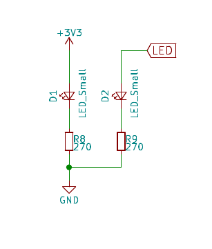
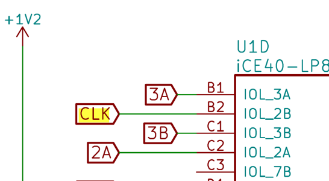
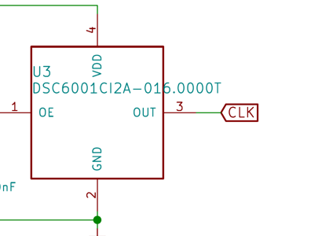

Installing the toolchain from source
====================================

To get started on need to install the open source toolchain for the ice40 fpga family.

IceStorm Flow
'''''''''''''

IceStorm flow is a fully open source Verilog-to-Bitstream flow for iCE40 FPGAs.

Yosys
^^^^^

`Yosys <https://github.com/YosysHQ/yosys/blob/master/README.md>`_ is a framework for RTL synthesis tools. It currently has extensive Verilog-2005 support and provides a basic set of synthesis algorithms for various application domains.

.. code-block:: bash

    apt-get install build-essential clang bison flex \
        libreadline-dev gawk tcl-dev libffi-dev git \
        graphviz xdot pkg-config python3    
    git clone https://github.com/YosysHQ/yosys
    cd yosys
    make 
    make install

Icestorm
^^^^^^^^

`Icestrom <https://github.com/cliffordwolf/icestorm>`_ contains the tools to perform reverse engineering but also the icepack and similar tools needed to convert the final design into something that can be loaded by the ice40. 

.. code-block:: bash

    git clone https://github.com/cliffordwolf/icestorm.git
    cd icestorm
    make 
    make install

Nextpnr
^^^^^^^

`Nexprn <https://github.com/YosysHQ/nextpnr>`_ is the next generation place

.. code-block:: bash

    git clone https://github.com/YosysHQ/nextpnr
    cd nextpnr
    cmake -DARCH=ice40 .
    make
    make install

Creating a blinky for the TinyFPGA-BX
'''''''''''''''''''''''''''''''''''''

Get the board layout
^^^^^^^^^^^^^^^^^^^^

.. code-block:: bash

    git clone https://github.com/tinyfpga/TinyFPGA-BX.git

    Cloning into 'TinyFPGA-BX'...
    remote: Enumerating objects: 108, done.
    remote: Total 108 (delta 0), reused 0 (delta 0), pack-reused 108
    Receiving objects: 100% (108/108), 648.10 KiB | 1.39 MiB/s, done.
    Resolving deltas: 100% (19/19), done.

.. code-block:: bash

    okular board/TinyFPGA-BX-Schematic.pdf

Search for led and found

Can not find the connector on the FPGA (the pdf generated was created
using print preview. Open the file in kicad and print it using the plot
option.

.. image:: img/led_fpga.png

Clock
^^^^^

Pin configuration
^^^^^^^^^^^^^^^^^

The PCF file format is not fully documented but it looks a bit like the icecube  variant.

Find `configuration <https://github.com/nesl/ice40_examples/blob/master/blinky/pinmap.pcf>`_ but a warning here
this is the old syntax (the --warn-no-port) has become the default.

.. code-block:: python
    :name: top.pcf

    set_io led  B3
    set_io clk  B2

Create Verilog file
^^^^^^^^^^^^^^^^^^^

.. code-block:: verilog

    module top (clk,led);
        input clk;
        output led;

        // We want to blink at 1 Hz and we have an input clock of 16Mhz
        // We therefore need to count to 16.000.000. In binary we need
        // log(16.000.000)/log(2) bit for this (24 bits)
        // python
        // Python 3.6.7 (default, Oct 22 2018, 11:32:17) 
        // >>> import math
        // >>> math.log(16e6)/math.log(2)
        // 23.931568569324174

        reg [23:0] counter;
        initial counter = 0;

        assign led = counter[23];

        always @(posedge clk) 
        begin
            counter <= counter +1;
            if (counter == 16000000 -1)
                counter <= 0;
        end
    endmodule

Launch yosys
''''''''''''

Yosys can synthesize designs and parse verilog file.

start yosys shell

.. code-block::

    /----------------------------------------------------------------------------\
    |                                                                            |
    |  yosys -- Yosys Open SYnthesis Suite                                       |
    |                                                                            |
    |  Copyright (C) 2012 - 2018  Clifford Wolf <clifford@clifford.at>           |
    |                                                                            |
    |  Permission to use, copy, modify, and/or distribute this software for any  |
    |  purpose with or without fee is hereby granted, provided that the above    |
    |  copyright notice and this permission notice appear in all copies.         |
    |                                                                            |
    |  THE SOFTWARE IS PROVIDED "AS IS" AND THE AUTHOR DISCLAIMS ALL WARRANTIES  |
    |  WITH REGARD TO THIS SOFTWARE INCLUDING ALL IMPLIED WARRANTIES OF          |
    |  MERCHANTABILITY AND FITNESS. IN NO EVENT SHALL THE AUTHOR BE LIABLE FOR   |
    |  ANY SPECIAL, DIRECT, INDIRECT, OR CONSEQUENTIAL DAMAGES OR ANY DAMAGES    |
    |  WHATSOEVER RESULTING FROM LOSS OF USE, DATA OR PROFITS, WHETHER IN AN     |
    |  ACTION OF CONTRACT, NEGLIGENCE OR OTHER TORTIOUS ACTION, ARISING OUT OF   |
    |  OR IN CONNECTION WITH THE USE OR PERFORMANCE OF THIS SOFTWARE.            |
    |                                                                            |
    \----------------------------------------------------------------------------/

    Yosys 0.7+627 (git sha1 e275692e, clang 6.0.0-1ubuntu2 -fPIC -Os)

Add the verilog file
''''''''''''''''''''

.. code-block::

    yosys> read_verilog top.v 
    1. Executing Verilog-2005 frontend.
    Parsing Verilog input from `top.v' to AST representation.
    Generating RTLIL representation for module `\top'.
    Successfully finished Verilog frontend.

The file is now parsed into RTL logic (gates, nands etc?)

Convert to json format.

.. code-block:: 

    yosys> synth_ice40 -top top -json top.json
    3.27. Printing statistics.

    === top ===

       Number of wires:                 14
       Number of wire bits:             83
       Number of public wires:           3
       Number of public wire bits:      26
       Number of memories:               0
       Number of memory bits:            0
       Number of processes:              0
       Number of cells:                 78
         SB_CARRY                       22
         SB_DFFESR                       1
         SB_DFFSR                       23
         SB_LUT4                        32

    3.28. Executing CHECK pass (checking for obvious problems).
    checking module top..
    found and reported 0 problems.

    3.29. Executing JSON backend.

Do placement
^^^^^^^^^^^^

.. code-block:: 

    nextpnr-ice40  --lp8k --json top.json --pcf top.pcf --asc top.asc --package cm81

Conver to bin file for flashing
^^^^^^^^^^^^^^^^^^^^^^^^^^^^^^^

Convert to bin file for flashing

.. code-block:: 

    icepack top.asc top.bin

and program
^^^^^^^^^^^

.. code-block:: bash

    tinyprog -p top.bin 

    TinyProg CLI
    ------------
    Using device id 1d50:6130
    Only one board with active bootloader, using it.
    Programming /dev/ttyACM0 with top.bin
    Programming at addr 028000
    Waking up SPI flash
    135100 bytes to program
    Success!

